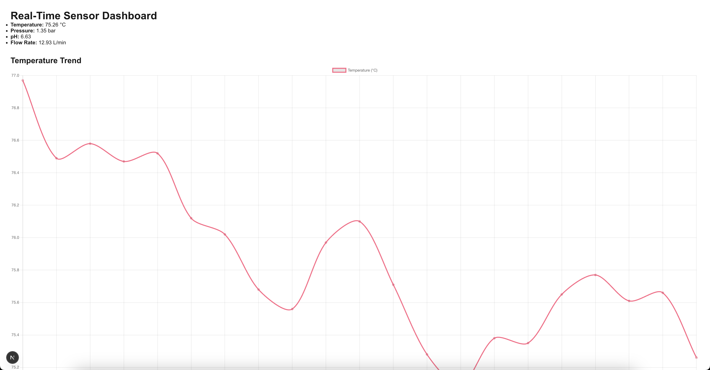

# Real-Time Process Monitoring Tool for Chemical Processes
Using simulated data from real chemical processes, this tool collects, visualizes, and analyzes temperature, pressure, flow rate, and pH data in real-time. 

# DEMO



# Technologies
* python
* Flask
* FastAPI
* React
* Matplot
* Chart.js

# Code-Snippet
```
def simulate_sensor_reading():
    for key in sensor_data:
        change = random.uniform(-fluctuation_ranges[key], fluctuation_ranges[key])
        sensor_data[key] += change
        sensor_data[key] = round(sensor_data[key], 2)

def print_sensor_data():
    timestamp = datetime.now().strftime("%Y-%m-%d %H:%M:%S")
    print(f"[{timestamp}]", end="")
    for key, value in sensor_data.items():
        print(f"{key.capitalize()}: {value}", end="")
    print()

```
This code snippet creates simulated data


# Author
* Daniel Jauregui
